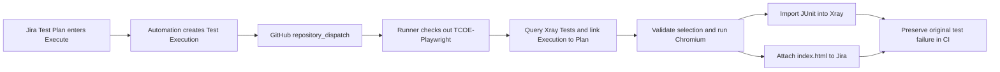

# Jira / Xray / Playwright orchestration

Supports **Jira Cloud + Xray Cloud** and **Jira Data Center + Xray Data Center**.
Cloud remains the default. For Data Center (including setup for Jira 10.3.22),
follow [Data Center configuration and live verification](docs/jira-datacenter.md).
An installed, compatible Xray app is required; live Data Center compatibility
has not yet been verified against your server.

This directory is the **playwright-ci-runner** repository. Copy the contents of
`source-repo/` into **TCOE-Playwright** (merge with an existing suite rather than
overwriting it). `PROMPT.md` is the original specification.

Your existing `D:\Playwright-Typescript-Framework` repository has now been integrated
directly; it does not need the `source-repo/` example copied over it. Set the runner's
`SOURCE_REPOSITORY` variable to `dvhiremath26/Playwright-Typescript-Framework`, and
set `SOURCE_REF` to the branch or commit containing those integration changes.
Its Tests retain `TPA-5`, `TPA-6`, and `TPA-7`; its custom report now writes the full
latest report into `TCOE-Report/index.html` for the single-file Jira attachment.



## Files

| Location | Purpose |
| --- | --- |
| `.github/workflows/run-xray-playwright.yml` | Dispatch, checkout, execution and publication |
| `scripts/xray-orchestrator.js` | Native Node.js fetch, GraphQL pagination, selection, import and attachment |
| `scripts/xray-datacenter.js` | Data Center REST selection, association, import and HTML attachment |
| `scripts/api-common.js` | Shared validation, HTTP timeouts/retries and report file checks |
| `source-repo/playwright.config.ts` | HTML + built-in JUnit reporters, Chromium |
| `source-repo/tests/example.spec.ts` | Self-contained browser test |
| `source-repo/tests/xray.ts` | Shared tag and static annotation helper |
| `docs/jira-automation.md` | Exact rule, headers, payload and smart values |
| `docs/secrets-and-permissions.md` | Credentials, permissions and configuration |
| `tests/` | Offline API and selection regression tests |

## Set up the two repositories

1. In TCOE-Playwright, merge `source-repo/` into the repository root. Commit the
   supplied `package-lock.json` alongside `package.json`. The example pins
   Playwright 1.58.2; validate the reporter contract when upgrading.
2. Replace `PROJ-101` with a real **Generic** Xray Test key and replace the demo
   page with your application's test flow. Add that Test to an Xray Test Plan.
3. From the source repository, run:

   ```sh
   npm ci
   npx playwright install chromium
   npm run typecheck
   npm test
   ```

4. Put this runner project's workflow and scripts on the runner repository's
   **default branch**. Keep its package files and tests for local verification.
   No runtime npm dependencies are needed in the runner.
5. In runner repository **Settings > Secrets and variables > Actions**, add the
   secrets for your deployment and `SOURCE_REPOSITORY` from the permissions guide
   (or the Data Center guide above).
   Set `SOURCE_REPOSITORY` to `your-owner/TCOE-Playwright`. Optionally set
   `SOURCE_REF` to a reviewed commit SHA (preferred for reproducibility), tag or
   branch; otherwise `main` is used. Never take a source ref from the dispatch.
6. Create an existing Test Execution in Jira for the first manual run. Under
   **Actions > Execute Xray Test Plan > Run workflow**, enter its key and the Plan key.
   Wait for Xray to index freshly created issues if selection reports them missing.
7. Confirm the Execution appears in the Plan's **Xray Test Executions** panel,
   the expected Tests have results, and the Jira HTML attachment opens after download.
8. Configure the [Jira automation rule](docs/jira-automation.md) for subsequent runs.

The workflow deliberately uses Node.js 20 as requested. Before deploying beyond
your organization's supported runtime window, upgrade it and rerun these checks.

## How test mapping works

Use `test('title', xray('PROJ-101'), async (...) => ...)`. Its explicit equivalent is:

```ts
test('Verify login', {
  tag: ['@PROJ-101'],
  annotation: [{ type: 'test_key', description: 'PROJ-101' }],
}, async ({ page }) => {
  // Your assertions.
});
```

The tag selects the case. The static annotation produces
`<property name="test_key" value="PROJ-101">` within its JUnit testcase and identifies
the existing Xray Test. Titles remain descriptive. Merely putting an issue key in
the title/tag does not supply this mapping. The pinned built-in reporter already
serializes annotations; do not add the obsolete `embedAnnotationsAsProperties`
option to it. See the [versioned Playwright reporter implementation](https://github.com/microsoft/playwright/blob/v1.58.2/packages/playwright/src/reporters/junit.ts).

Each selected key must identify exactly one case in the `chromium` project, with
one matching static annotation. Discovery fails on missing keys, duplicate cases,
multiple issue tags, mismatched annotations or compilation errors. This prevents
partial plans appearing successful. Use separate Test keys for parameterized
cases. This reference does not shard or aggregate multiple browser projects.
Playwright dependencies, if added to an existing config, must follow the same
mapping contract or be implemented as fixtures rather than untagged project tests.

The filter uses whitespace boundaries, so `@PROJ-1` does not match `@PROJ-10`.
Discovery reads the JSON reporter's dedicated temporary file, so dotenv and test
module startup messages on stdout cannot corrupt the selection data.
An empty Plan stops execution. Cloud retrieves nested Test pages in batches
of 100; unexpected offsets, changing totals and duplicate pages fail explicitly.
Data Center reads numbered REST pages until an empty page, rejecting duplicates.

## Failure and publication behavior

- A test failure does not prevent JUnit import, HTML attachment or
  GitHub artifact preservation. The final step restores a failed workflow result.
- Import and attachment are independent. Either failing also fails the workflow.
- Setup failures skip execution and publication. A discovery failure produces no
  new reports; publication attempts then fail clearly rather than reporting a pass.
- JUnit determines per-Test Run results (pass/fail, displayed according to your
  Xray statuses). Skips remain skips; they are not promoted to passes. Retries are
  disabled to avoid confusing retry aggregation. Jira issue workflow statuses are
  not transitioned by a JUnit import.
- In Cloud mode, fresh Xray authentication is performed for selection and import, so a long test
  run does not reuse the initial access token. Tokens are kept in memory.
- Read/auth calls retry transient failures twice with bounded backoff. Writes are
  not blindly retried: a timeout may occur after the service accepted the write.
- Calls time out after 60 seconds; the job has a 60-minute budget. Cancellation or
  runner loss can prevent even `always()` cleanup. GitHub artifacts are a recovery
  aid, not a delivery guarantee.
- HTML uploads are limited locally to 100 MiB and XML to 50 MiB; your service's
  lower limit still applies. The latest report is `TCOE-Report/index.html`, relative
  to the source repository root. Only this file is attached to Jira as `index.html`.
  Download it to view locally. Screenshots, videos and traces referenced in separate
  files will not be included in that attachment. The complete report directory is
  still preserved in the GitHub Actions artifact for troubleshooting.
- A rerun can add another attachment and update the same results. There is no
  exactly-once delivery guarantee. Prefer a new Test Execution for each new request.
  Concurrency serializes a shared Execution; GitHub may replace pending runs in
  the same concurrency group.

## Local runner commands

```sh
npm ci
npm test
npm run check
# After npm ci in source-repo: verify real Playwright discovery and JUnit mapping.
npm run test:integration
# Export TEST_PLAN_KEY, TEST_EXEC_KEY and credentials in your shell first.
node scripts/xray-orchestrator.js validate
node scripts/xray-orchestrator.js select
node scripts/xray-orchestrator.js run
node scripts/xray-orchestrator.js import
# Attach the generated TCOE-Report/index.html.
node scripts/xray-orchestrator.js attach
```

`.env.example` is documentation; it is not loaded automatically. By default the
source checkout is `tcoe-playwright-repo/`. Set `SOURCE_DIR`, `XML_REPORT_PATH` and
`HTML_REPORT_PATH` for local alternate paths; `HTML_REPORT_PATH` is also supported
as a GitHub Actions repository variable. Selection writes a non-secret
`.state/selection.json` and exports `grep` when `GITHUB_OUTPUT` is present. Execution
rebuilds that filter and passes it directly to the installed Playwright CLI using
an argument array, equivalent to `npx playwright test --project=chromium --grep ...`.

## Troubleshooting

| Symptom | Check |
| --- | --- |
| GitHub accepts dispatch but no workflow appears | Workflow exists on default branch; event type matches; Actions enabled |
| Checkout fails | SOURCE_REPOSITORY, SOURCE_REF, PAT source access, organization approval/SSO |
| Xray 401 / 403 | Xray client credentials belong to this tenant; permissions and license |
| Plan/Execution not visible | Correct issue types, Browse/issue security permissions, indexing delay |
| Key matched 0 / 2 cases | Exact tag, static annotation, one case per key, Chromium project |
| New Tests created unexpectedly | Existing suite bypassed annotation validation or changed reporters; inspect XML test_key |
| Jira 401 / 403 / 404 | Account email, unscoped token, tenant, Browse/Create attachments, issue security |
| Jira 413 | Attachment size limit; reduce trace/video volume |
| Upload timed out | Inspect Jira/Xray before retrying to avoid duplicate attachments/imports |

Live dispatch and publication require your GitHub/Jira/Xray credentials. The
offline tests mock the services and do not prove tenant-specific permissions.
